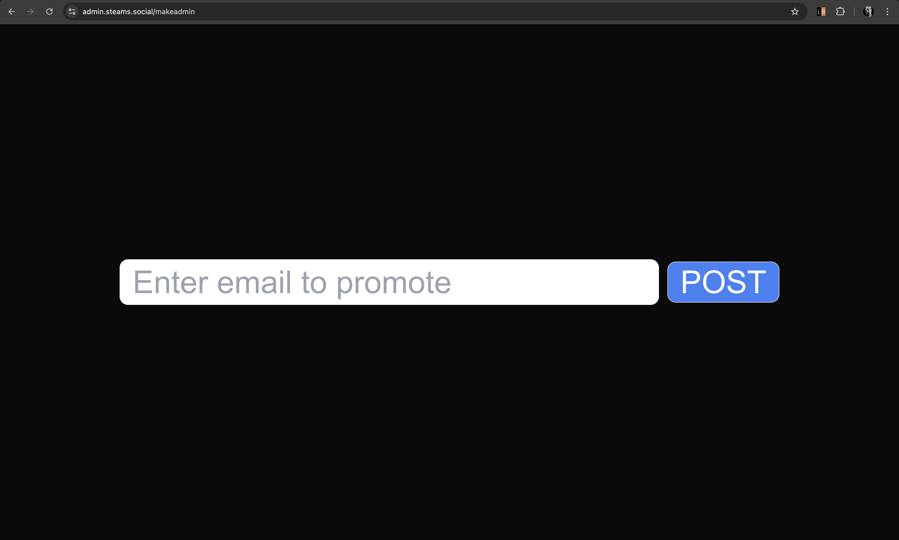
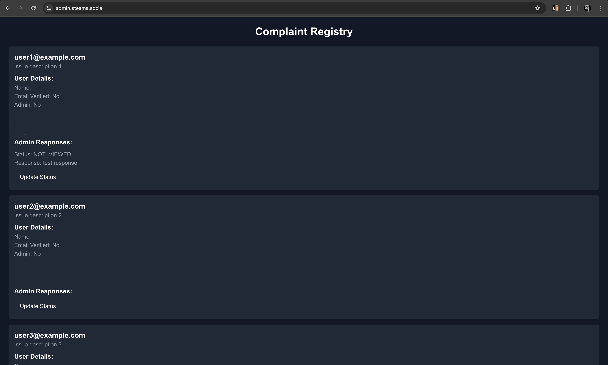
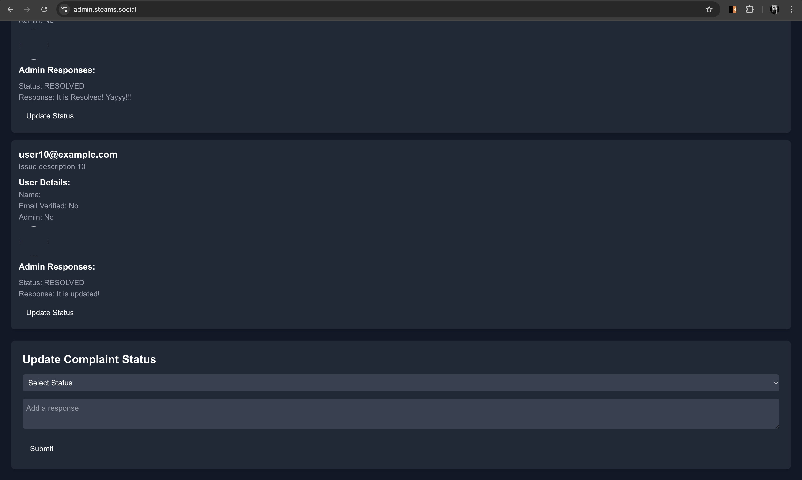

# Admin Page: Pollution Complaint Management System in Association with STEAM

### STEAM - Satellite Tracking for Evaluation and Analysis of Marinery

The **Admin Page** serves as the backbone of the pollution complaint management platform, developed to address and resolve pollution-related complaints in nearby water bodies. This tool integrates seamlessly with STEAM's capabilities, enhancing environmental monitoring and administrative efficiency.

Key Features of the Admin Page include:

- **Complaint Oversight and Management**: 
  Administrators can view and manage user-reported pollution complaints through an organized dashboard.
  
- **Dynamic Complaint Status Updates**: 
  Real-time tracking and updates ensure transparency and build community trust.
  
- **User Engagement via Response System**: 
  Admins can directly communicate resolutions or progress updates to users for each complaint.
  
- **Historical Record Maintenance**: 
  All actions and resolutions are documented for analysis and reporting, promoting accountability.

This system supports environmental sustainability by efficiently addressing community concerns and leveraging the advanced capabilities of STEAM for real-time monitoring.

---

## Demo Interface

Below are examples of the Admin Page's interface, showcasing its design and features:

  
  
  

The interface is designed for ease of use while maintaining a professional, data-driven layout to optimize administrative workflows.

---

## Backend Architecture and Deployment

The backend architecture is engineered for reliability, security, and scalability. Below are its primary components:

1. **Hosting and Tunneling**:
   - The backend is hosted locally using **Docker**, ensuring a modular and controlled environment.
   - Public accessibility is facilitated via **Cloudflared** tunneling to the domain `https://api.steams.social`.

2. **Domain and Subdomain Configuration**:
   - **Subdomain**: `api`  
   - **Domain**: `steams.social`  

3. **SSL Termination**:
   - **NGINX** is utilized for SSL termination, enforcing secure HTTPS communication.
   - The certificates are integrated within Docker, ensuring encrypted data exchanges.

4. **Cloudflare DNS Integration**:
   - DNS settings are managed via Cloudflare, streamlining the connection to the public domain and providing robust performance and security.

---

## Running the Application

To start the development server, use the following commands:

```bash
pnpm run dev
# or
npm run dev
```

These commands initiate the backend locally, supporting testing and further development of the platform.

---

## Hosted Platform

The Admin Page is deployed and accessible at the following URL:  
[https://admin.steams.social/](https://admin.steams.social/)  

This Cloudflare-hosted page ensures high availability, speed, and security for administrators.

---

## Technical Highlights

- **Integration with Docker**: Simplifies the deployment process and ensures a portable and consistent runtime environment.
- **Secure HTTPS Communication**: SSL termination via NGINX and DNS integration with Cloudflare guarantees data integrity.
- **Scalable Tunneling via Cloudflared**: Connects the locally-hosted backend to a global audience without exposing vulnerabilities.

